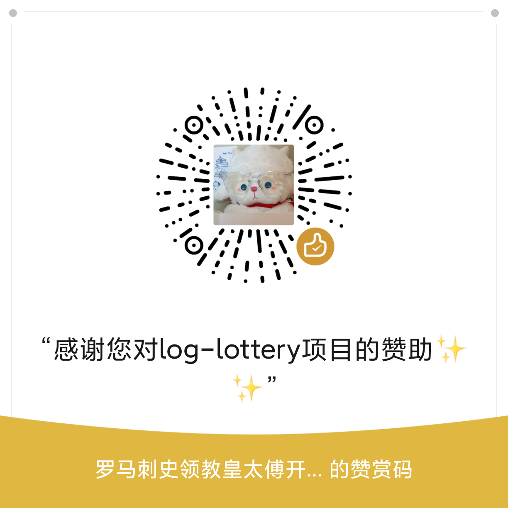

# SphereLucky 🚀🚀🚀🚀

log-lottery是一个可配置可定制化的抽奖应用，炫酷3D球体，可用于年会抽奖等活动，支持奖品、人员、界面、图片音乐配置。

> 如果进入网站遇到图片无法显示或有报错的情况，请先到【全局配置】-【界面配置】菜单中点击【重置所有数据】按钮清除数据后进行更新。

> 不支持内定功能

## 要求

使用PC端最新版Chrome或Edge浏览器。

访问地址：

<https://lottery.to2026.xyz/log-lottery>

## TODO

- [x] 🕍 炫酷3D球体，年会抽奖必备，开箱即用
- [x] 💾 本地持久化存储
- [x] 🎁 奖品奖项配置
- [x] 👱 抽奖名单设置管理
- [x] 🎼 播放背景音乐
- [x] 🖼️ excel表格导入人员名单、抽奖结果使用excel导出
- [x] 🎈 可增加临时抽奖
- [x] 🧨 国际化多语言
- [x] 🍃 更换背景图片
- [x] 🚅 添加docker构建

## 详细介绍

### 配置参与人员

于人员配置管理界面下载excel模板，按要求填好数据后导入即可。

### 配置奖项

于奖项配置管理界面添加奖项后，自定义修改名称、抽取人数、是否全员参加、图片显示。

### 界面配置

可自定义配置标题、列数、卡片颜色、首页图案等。

### 图片和音乐管理

上传图片或音乐即可，数据使用indexdb在浏览器本地进行存储。


## 技术

- vue3
- threejs
- indexdb
- pinia
- daisyui

## 开发

安装依赖

```bash
pnpm i
or
npm install
```

开发运行

```bash
pnpm dev
or
npm run dev
```

打包

```bash
pnpm build
or
npm run build
```

> 项目思路来源于 <https://github.com/moshang-xc/lottery>

## Docker支持

以下任意方式选一种即可

1. 拉取镜像，从Docker Hub拉取镜像[log-lottery](https://hub.docker.com/r/log1997/log-lottery)

    ```bash
    docker pull log1997/log-lottery:latest
    ```

    运行容器

    ```bash
    docker run -d --name log-lottery -p 9279:80 log1997/log-lottery:latest
    ```

2. 手动构建镜像

    ```bash
    docker build -t log-lottery .
    ```

    运行容器

    ```bash
    docker run -d -p 9279:80 log-lottery
    ```

    容器运行成功后即可在本地通过<http://localhost:9279/log-lottery/>访问

## 软件安装包

可前往[Releases](https://github.com/LOG1997/log-lottery/releases)下载。

目前只支持windows平台使用，跨平台安装包暂不支持，如有需要请自行编译，参照[贡献文档](https://github.com/LOG1997/log-lottery/blob/main/.github/CONTRIBUTING.md)

## 支持项目

<h3>💝 赞助支持</h3>

<p><em>如果您觉得 log-lottery 对您有帮助，欢迎赞助支持，您的支持是我们不断前进的动力！</em></p>

<div>
 
</div>

<br>

## Contributors

Thanks to all the people who have contributed to this project!

[](https://github.com/LOG1997/log-lottery/graphs/contributors)

## Star History

[](https://star-history.com/#LOG1997/log-lottery&Date)

## License

[MIT](http://opensource.org/licenses/MIT)
